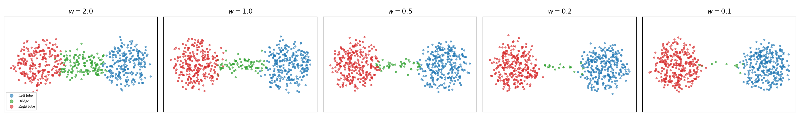
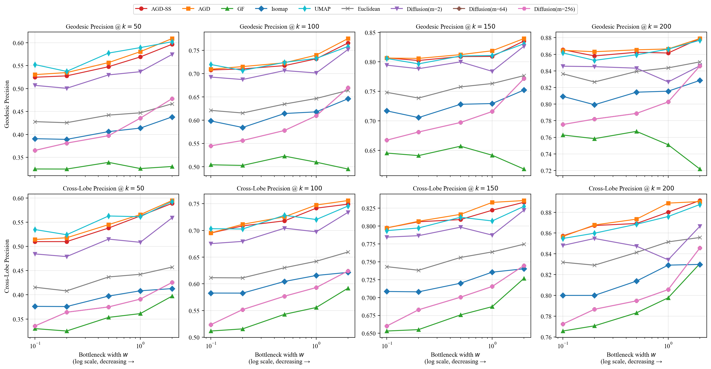
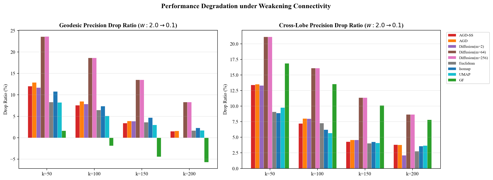
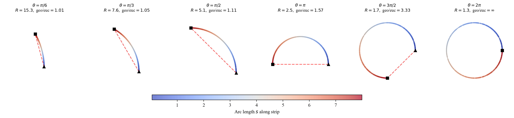
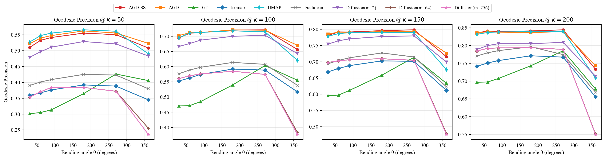

**If you encounter render error of math notations, please check the README.pdf, which contains exactly the same content.**

---

**Figure 1: Dumbbell manifold overview at five bottleneck widths.** *Data generation:* A 2D dumbbell manifold consists of two disks of radius $R=2$ centred at $(\pm R + L/2,\, 0)$ connected by a rectangular bridge of width $w$ and length $L=4$. We sample $N=600$ points distributed proportionally to area (two lobes + bridge, with a minimum of 10 bridge points). The 2D manifold is then embedded into $\mathbb{R}^{50}$ via a random orthogonal rotation $Q \in O(50)$ followed by additive Gaussian noise $\sigma = 0.3$ in all 50 dimensions. *Visualisation:* PCA projection from $\mathbb{R}^{50}$ back to 2D. Blue = left lobe, green = bridge, red = right lobe. Bottleneck widths sweep $w \in \{2.0, 1.0, 0.5, 0.2, 0.1\}$: at $w = 2.0$ the bridge is as wide as the lobe radius and points mix smoothly; at $w = 0.1$ the bridge is $20\times$ narrower, leaving only around 10 bridge points and producing a near-disconnection.

---

**Figure 2: Geodesic Precision (top row) and Cross-Lobe Precision (bottom row) vs. bottleneck width.** Nine methods are evaluated on the dumbbell manifold ($N=600$, $\mathbb{R}^{50}$, $\sigma=0.3$) at widths $w \in \{2.0, 1.0, 0.5, 0.2, 0.1\}$. Columns correspond to $k \in \{50, 100, 150, 200\}$. *Methods:* AGD-SS/AGD ($\psi=32$, $t=100$); Diffusion ($m \in \{2, 64, 256\}$, $10$-NN graph); Isomap ($k=9$); Euclidean ($\mathbb{R}^{50}$); GF (200 trees). *Metrics.* For a given distance estimate $\hat{d}$ and a query point $x_i$, let $\hat{\mathcal{N}}_k(x_i)$ denote the $k$ nearest neighbours of $x_i$ under $\hat{d}$, and let $\mathcal{N}_k^*(x_i)$ denote the $k$ nearest neighbours under the *true* geodesic distance. *Geodesic Precision (GP) @ $k$* $= \frac{1}{N}\sum_{i=1}^{N} \frac{|\hat{\mathcal{N}}_k(x_i) \cap \mathcal{N}_k^*(x_i)|}{k}$, i.e. the average overlap between estimated and true geodesic $k$-NN, over all $N$ points. *Cross-Lobe Precision (CL) @ $k$*: let $\mathcal{L}$ denote the set of points in the left lobe. Then $\text{CL@}k = \frac{1}{|\mathcal{L}|}\sum_{x_i \in \mathcal{L}} \frac{|\hat{\mathcal{N}}_k(x_i) \cap \mathcal{N}_k^*(x_i)|}{k}$. CL isolates performance on the "bottleneck side" of the manifold and is more sensitive to connectivity-related errors than GP.

---

**Figure 3: Performance drop ratio (%) from $w=2.0$ to $w=0.1$.** Drop ratio in GP (left) and CL (right) when moving from the widest bottleneck ($w=2.0$, strong connectivity) to the narrowest ($w=0.1$, near-disconnection), for each method at each $k$. *Computation:* $\text{Drop Ratio} = \frac{\text{metric}(w=2.0) - \text{metric}(w=0.1)}{\text{metric}(w=2.0)} \times 100\%$; larger bars indicate greater vulnerability to bottleneck narrowing.

---

**Figure 4: Bent-strip manifold at six bending angles (top-down view).**
**Data generation:** A 2D rectangular strip of *fixed* arc length $\ell=8$ and width $W=3$ is bent into a cylindrical arc of angle $\theta$ and radius $R = \ell / \theta$. Keeping the arc length constant ensures that the manifold area and point density remain identical across all panels; only the curvature (and hence the degree of non-convexity) changes. We sample $N=600$ points uniformly in intrinsic coordinates $(s, z)$ with $s \in [0, \ell]$ (arc-length position) and $z \in [0, W]$ (height along the cylinder axis). The 2D surface is embedded in $\mathbb{R}^{50}$: the three non-trivial coordinates $(R\cos(s/R),\; R\sin(s/R),\; z)$ are zero-padded to 50 dimensions, then multiplied by a random orthogonal matrix and perturbed with i.i.d. Gaussian noise $\sigma = 0.3$. **Visualization:** Each panel projects the 3D cylinder coordinates onto the $(x, y)$ plane. Color encodes the arc-length coordinate $s$ (blue $\to$ red).Black markers denote arc start ($\blacktriangle$) and end ($\blacksquare$); the red dashed line is the Euclidean chord. **Non-convexity ratio** = (geodesic arc length) / (Euclidean chord) between endpoints: it grows monotonically from $1.01$ ($\theta = \pi/6$, nearly flat) through $1.57$ ($\theta = \pi$, U-shape) to $\infty$ ($\theta = 2\pi$, full cylinder where endpoints coincide and the chord collapses to zero). Bending angles sweep $\theta \in \{\pi/6,\, \pi/3,\, \pi/2,\, \pi,\, 3\pi/2,\, 2\pi\}$.

---

**Figure 5: Geodesic Precision vs. bending angle $\theta$ (non-convexity) experiment on the bent-strip manifold.**
